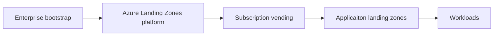

Welcome to the Azure Landing Zones technical documentation site.
This site provides guidance on how to deploy and manage Azure Landing Zones using the solutions we provide.

Use the navigation links on the left to explore the documentation.

## Definitions and Concepts

Please see our [documentation on Learn](https://learn.microsoft.com/azure/cloud-adoption-framework/ready/landing-zone/) for an introduction to the concepts that we will build on here.

## The Azure Landing Zones Journey

The Azure Landing Zones journey is a multi-step process that starts with the enterprise bootstrap and ends with the deployment of workloads.

### Enterprise bootstrap

The enterprise bootstrap is the first step in the Azure Landing Zones journey.
It is the process of setting up the foundational components that will be used to deploy and manage Azure Landing Zones.
In this step we ensure we have the correct access and some subscriptions to work with.

### Azure Landing Zones platform

The Azure Landing Zones platform is the core of the Azure Landing Zones journey.
It provides the core governance, networking, security and management components that will be used to deploy and manage Azure Landing Zones.

### Subscription vending

Subscription vending is the process of automating the creation of new subscriptions for use by the organization.

### Application landing zones

Application landing zones build upon subscription vending to provide applicaiton teams with a pre-configured environment to deploy their workloads.

### Workloads

Workloads are the applications and services that are deployed into the Azure Landing Zones.
