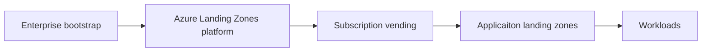

Welcome to the Azure Landing Zones technical documentation site.
This site provides guidance on how to deploy and manage Azure Landing Zones using the solutions we provide.

Use the navigation links on the left to explore the documentation.

## Definitions and Concepts

Please see our [documentation on Learn](https://learn.microsoft.com/azure/cloud-adoption-framework/ready/landing-zone/) for an introduction to the concepts that we will build on here.

## The Azure Landing Zones Journey

The Azure Landing Zones journey is a multi-step process that starts with the enterprise bootstrap and ends with the deployment of workloads.

### Enterprise bootstrap

The enterprise bootstrap is the first step in the Azure Landing Zones journey.
It is the process of setting up the foundational components that will be used to deploy and manage Azure Landing Zones.
In this step we ensure we have the correct access and some subscriptions to work with.

### Access

You will need the correct access to Azure to deploy the core components for Azure Landing Zones.
You need to be able to create management groups, and assign policy and roles.
The built-in role `Management Group Contributor` provides the necessary permissions to create and manage management groups.
This is typically assigned at the parent management group under which the Azure Landing Zones will be deployed.

It is also possible to have a organizational root management group provided to you by your organization but you will require `Owner` permissions on this management group to deploy the Azure Landing Zones platform.
This is becasue Azure Landing Zones assigns policies with DeployIfNotExists and modify effects, which require role assignments to be created.

### Azure subscriptions

You will need some Azure subscriptions to work with to deploy the core compoents for Azure Landing Zones, e.g. the central Log Analytics workspace, the core networking components, etc.

We typically recommend these subscriptions are created in the Azure Portal or using the CLI tools.

We recommend the following subscriptions:

- **connectivity** - this subscription is used to deploy the core networking components for the Azure Landing Zones.
- **management** - this subscription is used to deploy the core management components for the Azure Landing Zones.
- **identity** (Optional) - this subscription is used to host AD-DS domain controllers.

### Azure Landing Zones platform

The Azure Landing Zones platform is the core of the Azure Landing Zones journey.
It provides the core governance, networking, security and management components that will be used to deploy and manage Azure Landing Zones.

Included in the Azure Landing Zones platform are:

- **Management groups** - used to organize subscriptions and resources.
- **Policy** - used to enforce governance and compliance.
- **Role-based access control (RBAC)** - used to control access to resources.
- **Centralized logging** - used to collect and analyze logs from Azure resources.
- **Networking** - used to provide connectivity between resources.

The reference management group and policy structure for Azure Landing Zones is published in the [Azure Landing Zones Library](https://azure.github.io/Azure-Landing-Zones-Library/).

### Subscription vending

Subscription vending is the process of automating the creation of new subscriptions for use by the organization.

To be able to automate the creation of subscriptions, you will need to have the correct permissions.
These permissions are asssigned at the billing scope and the process is documented [here](https://learn.microsoft.com/azure/cost-management-billing/manage/programmatically-create-subscription).

### Application landing zones

Application landing zones build upon subscription vending to provide application teams with a pre-configured environment to deploy their workloads.

### Workloads

Workloads are the applications and services that are deployed into the Azure Landing Zones.
